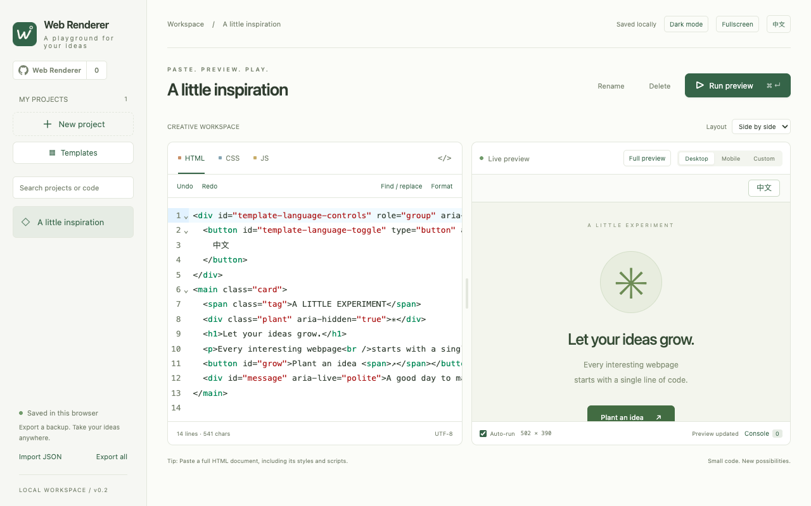
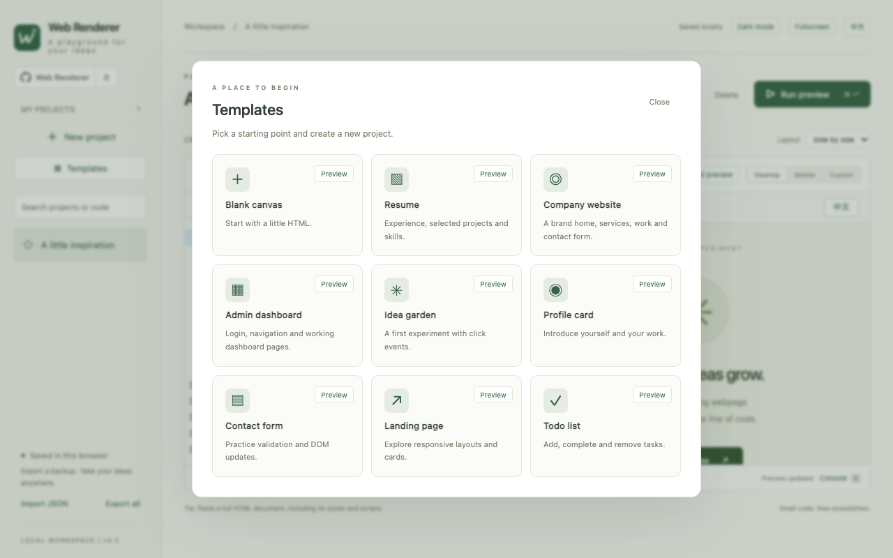
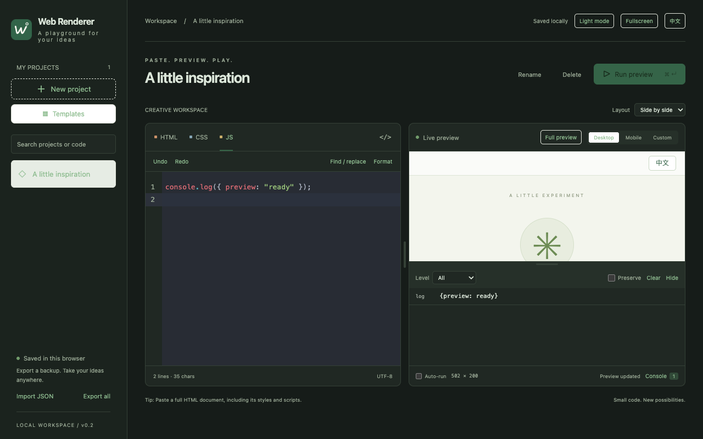

# Web Renderer

**English** | [简体中文](README.zh-CN.md)

Edit HTML, CSS and JavaScript in your browser, preview changes instantly, and build web prototypes. Available as a Chrome / Edge extension or a local web app, with projects saved in your browser.

[**Install from Chrome Web Store →**](https://chromewebstore.google.com/detail/web-renderer-%C2%B7-%E7%BD%91%E9%A1%B5%E6%B8%B2%E6%9F%93%E5%B7%A5%E5%85%B7/fpncpflbmojlefkajgpoijajhhfidkea) · [**Install from Microsoft Edge Add-ons →**](https://microsoftedge.microsoft.com/addons/detail/jmlcddodoomgbdkflcclldioiphngaaa) · [Download the extension](https://github.com/kiritokun07/web-renderer/releases/latest)



## Features

- **Code editor:** Syntax highlighting, completion, formatting, find and replace, undo and redo.
- **Live preview:** Automatic or manual execution, desktop, mobile and custom viewport sizes, adjustable layouts and fullscreen modes.
- **Debug console:** View logs and runtime errors, filter or clear output, and drag to adjust the console height.
- **Template library:** Nine templates, including a blank canvas, resume, company website and admin dashboard. Preview before creating a project; every template supports English and Chinese.
- **Project management:** Create, rename, search and automatically save projects, with JSON import and export.
- **Interface settings:** English and Chinese, light and dark themes, and a GitHub repository link with a star count.

## Screenshots

### Template library

Preview a template, then create a project from it.



### Dark mode and console

Edit code in dark mode and inspect logs below the preview.



## Installation

### Install from the Chrome Web Store

Open [Chrome Web Store](https://chromewebstore.google.com/detail/web-renderer-%C2%B7-%E7%BD%91%E9%A1%B5%E6%B8%B2%E6%9F%93%E5%B7%A5%E5%85%B7/fpncpflbmojlefkajgpoijajhhfidkea) in Chrome, click **Add to Chrome**, and complete installation. Find and pin **Web Renderer** in your browser toolbar, then click its icon to open the workspace.

### Install from the Edge store

Open [Microsoft Edge Add-ons](https://microsoftedge.microsoft.com/addons/detail/jmlcddodoomgbdkflcclldioiphngaaa), click **Get**, and complete installation. Find and pin **Web Renderer** in your browser toolbar, then click its icon to open the workspace.

### Install manually in Chrome / Edge

1. Download the extension runtime package (`web-renderer-edge-*.zip`) from [Releases](https://github.com/kiritokun07/web-renderer/releases/latest) and extract it. The same package can also be loaded manually in Chrome.
2. Open `chrome://extensions` in Chrome or `edge://extensions` in Edge.
3. Enable **Developer mode** and click **Load unpacked**.
4. Select the extracted folder containing `manifest.json`, then click the extension icon to open the workspace.

Manual installation does not require Node.js or npm dependencies.

## Run locally

Install Node.js 20 or later, then run:

```bash
git clone https://github.com/kiritokun07/web-renderer.git
cd web-renderer
npm start
```

Open <http://127.0.0.1:4173> in your browser. The repository includes the files needed to run the app, so `npm install` is not required. Use the local server instead of opening `index.html` directly.

## Usage

1. Create a new project, or open the template library to preview and choose a template.
2. Edit or paste code in the HTML, CSS and JS tabs. The preview updates automatically. You can also disable automatic execution and click **Run preview** or press `⌘ Enter` / `Ctrl Enter` to run manually.
3. Change the preview size, drag the dividers to adjust the layout, or enter fullscreen. Use the exit button or press `Esc` to leave fullscreen.
4. Open the console below the preview to inspect logs and errors. Use formatting and find/replace to organize your code.
5. Projects are saved automatically in the current browser. Export all projects as JSON for backup, or import JSON to transfer them to another browser. Imports add copies of the projects.

The admin dashboard template includes the demo credentials `admin / admin123`. Sign in to explore its menus and pages; it is a frontend demo only.

Projects do not sync automatically between browsers or devices, and the local web app and extension have separate storage. Export a backup before clearing browser data or uninstalling the extension. Preview supports plain HTML, CSS and JavaScript; npm dependencies, JSX / TypeScript compilation and remote JavaScript libraries are not supported.

See the [privacy policy](PRIVACY.md) for details.
